# Implementation and Analysis of QoS Simple Priority Controller in Software Defined Networking using Mininet and POX Controller

## Department of CSE, PES University  
**Course:** Computer Networks  
**Project Type:** SDN Mininet Project  
**Student Name:** Pratham Kumar  
**SRN No.:** PES2UG24CS368  
**PRN No.:** PES2202400086  

---

## 1. Project Overview

This project presents the implementation and analysis of a **QoS Simple Priority Controller** in a Software Defined Networking environment using **Mininet** and the **POX Controller**. The main purpose of the project is to understand how an SDN controller can centrally observe traffic, classify it into different priority levels, and analyze network behavior under single-flow and multi-flow conditions.

Traditional networks tightly couple the control plane and data plane inside networking devices. In contrast, SDN separates these two functions. The forwarding devices mainly handle packet forwarding, while the controller makes decisions about network behavior. This separation makes the network programmable, flexible, and easier to manage. In this project, that SDN concept is explored through a simulated network in Mininet and a controller implemented in POX. 

The project specifically focuses on **Quality of Service (QoS)** using a simple priority-based approach. Different traffic types were treated as different priority classes. ICMP traffic was treated as high priority, HTTP traffic as medium priority, and bulk TCP traffic generated using iPerf as low priority. The behavior of these traffic flows was observed both individually and under simultaneous contention through a bottleneck switch. This allowed us to study latency-sensitive traffic, application traffic, and bulk transfer traffic in a controlled SDN setup. 

---

## 2. Introduction to SDN

Software Defined Networking is a networking paradigm in which the intelligence of the network is moved from distributed devices into a logically centralized controller. This controller communicates with switches using protocols such as OpenFlow and can dynamically influence forwarding behavior. SDN is important because it enables programmability, centralized monitoring, policy enforcement, traffic engineering, and easier experimentation.

In a conventional network, each switch or router independently makes forwarding decisions using locally stored rules. In SDN, the controller has a global view of the network and can react to network events such as new flows, congestion, failures, or policy violations. This is especially useful when implementing traffic classification, access control, routing policies, and QoS behavior.

In this project, POX acts as the SDN controller and Mininet acts as the virtual network emulator. POX receives `PacketIn` events from switches, inspects the incoming traffic, and classifies it into different priority levels. Mininet provides hosts, switches, and links in software, allowing the entire experiment to be performed on a single Ubuntu virtual machine. 

---

## 3. Introduction to QoS and Priority Scheduling

Quality of Service refers to the ability of a network to treat traffic differently depending on its importance and performance requirements. Not all traffic has the same needs. Some traffic, such as control messages or interactive communication, is more sensitive to delay. Other traffic, such as file transfer or bulk data transfer, can tolerate more delay.

A priority-based QoS model assigns different preference levels to different traffic classes. In a simple priority controller:

- high-priority traffic should receive faster and more reliable handling,
- medium-priority traffic should receive moderate preference,
- low-priority traffic should still be served, but can tolerate more competition and delay.

This project demonstrates that idea in an SDN setting by observing three traffic types:
- **ICMP** for high-priority traffic,
- **HTTP on port 8080** for medium-priority traffic,
- **bulk TCP on port 5001** using iPerf for low-priority traffic.

The emphasis of the project is not on industrial-grade queue scheduling, but on the SDN-side classification, observation, and analysis of traffic behavior under bottleneck conditions. 

---

## 4. Problem Statement

The goal of this project is to implement an SDN-based solution using Mininet and an OpenFlow controller, demonstrating:

- controller-switch interaction,
- packet classification logic,
- handling of `PacketIn` events,
- flow behavior under different traffic conditions,
- performance observation using tools such as Wireshark, ping, HTTP, and iPerf.

The project also aims to validate network behavior under different scenarios and provide proof through screenshots, logs, and reports. The faculty requirements explicitly emphasized topology creation, controller logic, observable scenarios, proof of execution, and GitHub documentation. :contentReference[oaicite:6]{index=6}

---

## 5. Objectives

The objectives of this project are:

1. To understand the SDN model and the separation of control plane and data plane.
2. To create a custom Mininet topology representing a bottleneck-based network.
3. To implement a POX controller capable of handling `PacketIn` events.
4. To classify traffic into high, medium, and low priority categories.
5. To generate and analyze ICMP, HTTP, and TCP bulk traffic.
6. To study single-flow and mixed-flow behavior through a bottleneck switch.
7. To verify traffic at the packet level using Wireshark.
8. To document the entire process in a professional and reproducible way. 

---

## 6. Tools and Technologies Used

The following tools and technologies were used in this project:

- **Ubuntu Linux VM** as the working environment
- **Mininet** for SDN network emulation
- **POX Controller** for SDN control logic
- **Python** for writing topology and controller code
- **Wireshark** for packet capture and analysis
- **ping** for ICMP traffic generation and latency observation
- **Python HTTP Server** for application-layer web traffic
- **iPerf / iPerf3** for bulk TCP traffic generation
- **Git and GitHub** for version control and final project submission

These tools collectively allowed both implementation and validation of the project. 

---

## 7. System Preparation and Installation

### 7.1 Updating the Ubuntu VM

Before starting Mininet and POX setup, the Ubuntu virtual machine was updated so that packages, dependencies, and system libraries were current.

```bash
sudo apt update
sudo apt upgrade -y
```

This step is important because dependency issues often arise in older or partially updated installations. The Mininet installation guide also begins with system update commands for this reason.

---

### 7.2 Installing Mininet

Mininet was installed using Ubuntu’s package manager:

```bash
sudo apt install mininet -y
```

This installs Mininet, Open vSwitch, and the required dependencies needed for virtual hosts, switches, and links. The installation manual provided for the course also recommends direct installation through the package manager as the simpler and recommended method.

---

### 7.3 Verifying Mininet Installation

Mininet can be verified using:

```bash
sudo mn
```

Inside the Mininet CLI:

```bash
pingall
```

A correct installation should show successful host-to-host communication with no packet loss. The course installation document lists this as the standard verification method.

---

### 7.4 Obtaining POX Controller

POX was used as the SDN controller for this project. The controller code was placed in the ext directory of the POX repository so that it could be loaded as a custom POX module.

---

## 8. Project Title Explanation

The title of the project is:

**Implementation and Analysis of QoS Simple Priority Controller in Software Defined Networking using Mininet and POX Controller**

Each part of the title is meaningful:
- **Implementation** refers to developing the topology, controller, and test scenarios.
- **Analysis** refers to observing results through ping, HTTP, iPerf, Wireshark, and controller logs.
- **QoS Simple Priority Controller** refers to the custom controller logic that classifies traffic into different priority levels.
- **Software Defined Networking** refers to the SDN architecture used in the experiment.
- **Mininet and POX Controller** specify the tools used for network emulation and control-plane logic.

This title precisely matches the work performed in the project.

---

## 9. Faculty Requirements and How They Were Addressed

The faculty guidelines required a Mininet topology, an SDN controller, PacketIn handling, explicit network behavior demonstration, validation through observable scenarios, and proof using screenshots or logs. A public GitHub repository with clean code and documentation was also required.

This project addresses those requirements as follows:

- **Custom topology** was implemented in topology/qos_topology.py
- **Controller logic** was implemented in controller/qos_controller.py
- **Packet classification** was done in the POX controller
- **Traffic scenarios** included individual, concurrent, and mixed traffic flows
- **Validation** was done using ping, curl, iPerf, controller logs, and Wireshark
- **Reports** were prepared in PDF format
- **Final project** was pushed to GitHub with screenshots and reports

**🎯 How latency is measured in your project**
1. Using ping (ICMP)
Command you used:

```bash
h1 ping h4
```

What it shows:
```bash
64 bytes from 10.0.0.4: icmp_seq=1 ttl=64 time=0.090 ms
```
The time = X ms is the latency (RTT)

**What exactly is this latency?**
It is Round Trip Time (RTT)
Meaning: Time taken for packet to go from h1 → h4 → back to h1

**📊 Where to look**
At the end of ping: rtt min/avg/max/mdev = 0.082/5.289/25.248/9.984 ms
Explain like this:
- min → best latency
- avg → overall latency
- max → worst latency (important)

**🎯 How we show "latency impact"**
**Case 1: Only ping (baseline)**

```bash
h1 ping -c 5 h4
```
We will see low latency

**Case 2: Ping + iPerf (congestion)**

```bash
h3 iperf -s -p 5001 &
h1 ping -c 10 h4 &
h1 iperf -c 10.0.0.3 -p 5001 -t 10
```
Now observe:
- ping time increases ⬆️
- delay fluctuates ⬆️
- max latency becomes high ⬆️

**💡 What is happening internally**
Because: iPerf is sending heavy TCP traffic, bottleneck switch s2 gets congested, packets wait in queue, ping gets delayed

**🧠 Simple explanation:**
**“Latency is measured using ICMP ping. The round-trip time (RTT) shown in milliseconds represents the delay. When only ping is running, latency is low. When bulk traffic like iPerf is added, congestion occurs at the bottleneck switch, causing an increase in latency. This demonstrates the impact of traffic load on delay.”**

  ---

## 10. Network Topology Design

The topology used in this project is:

```bash
 h1      h2
 |       |
  \     /
    s1 -------- s2 -------- s3
                 |           |
                 h3          h4
```
**Description:**
- h1 and h2 are connected to switch s1
- h3 is connected to switch s2
- h4 is connected to switch s3
- s1 is connected to s2
- s2 is connected to s3

Switch s2 acts as the **central bottleneck switch** . This design was intentionally chosen because it creates a natural point of contention where different traffic types must compete for limited resources. The topology therefore supports observation of QoS-related behavior under congestion-like conditions. The project reports and implementation screenshots both use this 3-switch, 4-host structure.

---

## 11. Traffic Priority Mapping

The controller classifies traffic into the following categories:

**Traffic Type** **Port/Protocol** **Priority Level**
ICMP	            ping	              High
HTTP	            TCP port 8080       Medium
Bulk TCP	        TCP port 5001	      Low

**Why this mapping was chosen**
- **ICMP** is considered delay-sensitive and useful for observing latency, so it was treated as high priority.
- **HTTP** is application traffic that should remain responsive, but is not as delay-sensitive as ICMP, so it was treated as medium priority.
- **Bulk TCP traffic** generated using iPerf represents high-volume transfer traffic, so it was treated as low priority for this simple QoS model.

---

## 12. Source Code Files

### 12.1 Topology File

topology/qos_topology.py
This file defines the custom 3-switch, 4-host topology. It creates the hosts, switches, host-to-switch links, and inter-switch links, and exposes the topology to Mininet under the short name qos.

### 12.2 Controller File

controller/qos_controller.py
This file implements the POX controller logic. The controller listens for PacketIn events, extracts packet information, identifies whether the traffic is ICMP or TCP, checks the relevant TCP ports, and logs the corresponding priority classification.

---

## 13. Step-by-Step Execution Procedure

### Step 1.a: Go to project folder

```bash
cd ~/sdn-qos-project
```

To enter the project directory where the topology, controller, screenshots, and reports are stored.

### Step 1.b: Kill old POX/controller processes

```bash
sudo pkill -f pox
```

To make sure port 6633 is free and no old controller instance interferes.

### Step 1.c: Cleanup of Mininet Environment

Before launching a fresh simulation, the Mininet environment was cleaned to remove stale switch instances, links, and background processes.

```bash
sudo mn -c
```

**Screenshot: screenshots/terminal/01_cleanup.png**

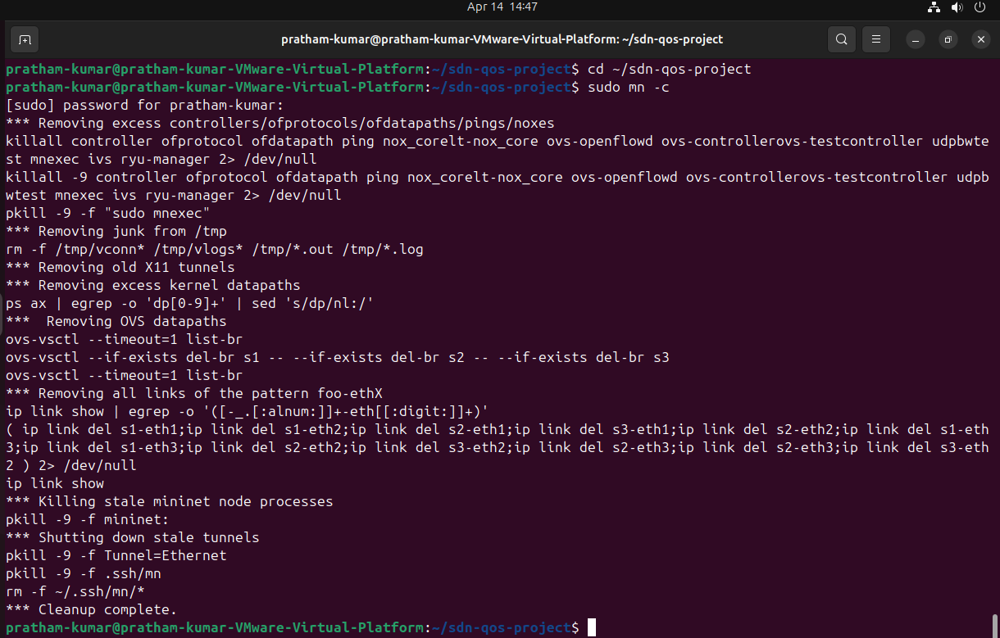

This step ensures that the experiment starts from a clean state and avoids interference from old virtual interfaces or switch configurations. The implementation report documents this as the first execution step.

### Step 2: Starting the POX Controller

The POX controller was started from the POX repository using the learning-switch module together with the custom QoS controller.

```bash
cd ~/pox
python pox.py log.level --DEBUG openflow.of_01 --port=6633 forwarding.l2_learning qos_controller
```

This command performs several important tasks:
- starts POX,
- enables OpenFlow 1.0 communication,
- listens on port 6633,
- uses forwarding.l2_learning for forwarding support,
- loads the custom qos_controller module.
- You should see: QoS priority controller module loaded and Listening on 0.0.0.0:6633

**Controller behavior screenshots:**
- screenshots/terminal/09_pox_controller1.png
- screenshots/terminal/09_pox_controller2.png
- screenshots/terminal/09_pox_controller3.png
- screenshots/terminal/09_pox_controller4.png

These screenshots show controller initialization and priority-specific logging behavior. The implementation report uses these images to demonstrate controller-side operation.

### Step 3: Running the Custom Mininet Topology

The custom topology was executed using the remote controller and bandwidth-controlled links.

```bash
cd ~/sdn-qos-project
sudo mn --custom topology/qos_topology.py --topo qos --controller=remote,ip=127.0.0.1,port=6633 --link tc,bw=10
```

This command:
- loads the custom topology file,
- uses the topology name qos,
- attaches the switches to the POX controller,
- creates tc links with bandwidth control,
- sets the link bandwidth to 10 Mbps.

**Screenshot:** screenshots/terminal/02_topology_run.png

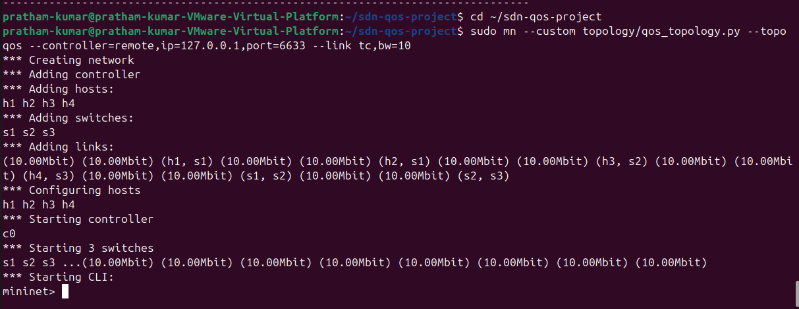

This screenshot shows hosts, switches, links, and the CLI startup.

### Step 4: Connectivity Testing

Once the topology was started, connectivity between all hosts was verified.

```bash
pingall
```

A successful execution produced:

```bash
*** Results: 0% dropped (12/12 received)
```

**Screenshot:** screenshots/terminal/03_pingall.png

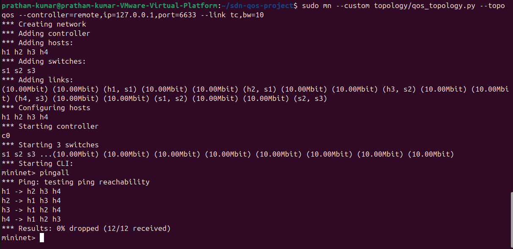

This confirms that the topology, controller, and forwarding logic are functioning correctly before scenario-based testing begins.

### Step 5.a: Run High Priority traffic

```bash
h1 ping -c 5 h4
```

This generates ICMP traffic from h1 to h4. ICMP is treated as high priority because it is latency-sensitive.

### Step 5.b: Run Medium Priority traffic (HTTP Communication Test)

To generate application-layer traffic, a simple Python HTTP server was started on h2 and accessed from h4.

```bash
h2 python3 -m http.server 8080 &
h4 curl http://10.0.0.2:8080
```
This step verifies that HTTP traffic is flowing correctly through the network.So this starts an HTTP server on h2 and accesses it from h4. HTTP on port 8080 is my medium-priority traffic.

**Screenshot:** screenshots/terminal/04_http_test.png

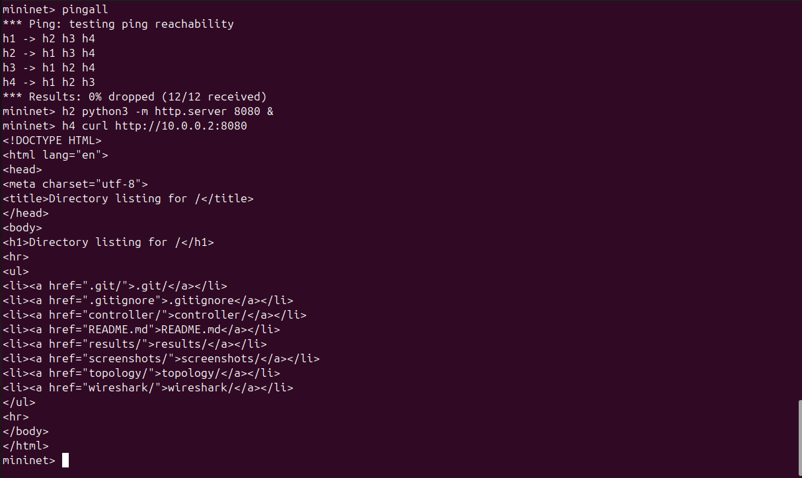

The output showing the HTML directory listing confirms that the request and response completed successfully.

### Step 5.c: Run Low Priority traffic (Throughput Test Using iPerf)

Bulk TCP traffic was generated using iPerf between h1 and h3.

```bash
h3 iperf -s -p 5001 &
h1 iperf -c 10.0.0.3 -p 5001 -t 5
```

This step allows throughput observation and creates a low-priority traffic flow for analysis. So this generates bulk TCP traffic using iPerf. Since it is throughput-oriented and not delay-sensitive, I treated it as low priority.

**Screenshot:** screenshots/terminal/05_iperf_test.png

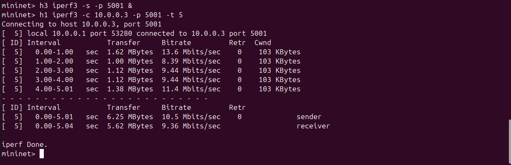

The output includes transfer size and bitrate, which are useful for throughput analysis. The implementation report records this as the bandwidth analysis step

### Step 6: Concurrent Traffic Scenario – Ping + iPerf

To observe the interaction between delay-sensitive and bulk traffic, ICMP and iPerf traffic were generated together.

```bash
h3 iperf3 -s -p 5001 &
h1 ping -c 10 h4 &
h1 iperf3 -c 10.0.0.3 -p 5001 -t 10
```

**Screenshot:** screenshots/terminal/06_ping_iperf.png

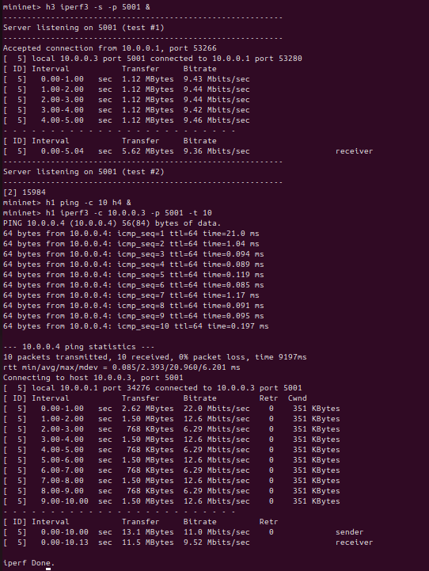

This scenario demonstrates that multiple traffic types can coexist and affect each other’s observed performance.

### Step 7: Concurrent Traffic Scenario – HTTP + iPerf

To compare application-layer communication with bulk transfer, HTTP and iPerf traffic were executed together.

```bash
h2 python3 -m http.server 8080 &
h3 iperf3 -s -p 5001 &
h4 curl http://10.0.0.2:8080 &
h1 iperf3 -c 10.0.0.3 -p 5001 -t 10
```

**Screenshot:** screenshots/terminal/07_http_iperf.png

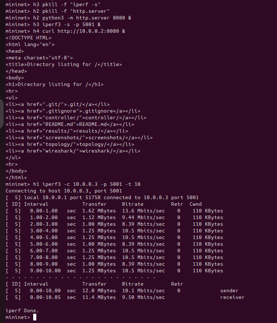

This scenario shows competition between medium-priority web traffic and low-priority bulk traffic.

### Step 8: Clean old background servers before mixed demo

```bash
h2 pkill -f "http.server"
h3 pkill -f "iperf3 -s"
h3 pkill -f "iperf -s"
```
To avoid ‘address already in use’ errors before starting the next scenario.

### Step 9: Final Mixed Scenario – Ping + HTTP + iPerf

The final scenario combined all three traffic types to represent a more realistic mixed-traffic network state.

```bash
h2 python3 -m http.server 8080 &
h3 iperf3 -s -p 5001 &
h1 ping -c 10 h4 &
h4 curl http://10.0.0.2:8080 &
h1 iperf3 -c 10.0.0.3 -p 5001 -t 10
```

**Screenshot:** screenshots/terminal/08_all_traffic.png

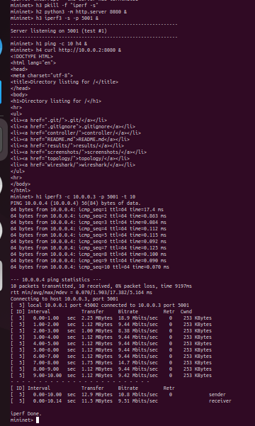

**Expected :**
- Ping output
- HTTP output
- iPerf throughput output
- Multiple priority logs in POX
This is one of the most important screenshots in the project because it demonstrates simultaneous traffic coexistence under the bottleneck topology.

---

## 14. Wireshark-Based Packet Analysis

Wireshark was used to capture and verify the actual packet behavior on the bottleneck interface. The chosen observation point was the middle switch path so that all critical traffic traversing the bottleneck could be seen together.

The display filter used was:

```bash
icmp || tcp.port == 8080 || tcp.port == 5001
```

This filter isolated the three traffic classes relevant to the QoS study.

### 14.1 ICMP Capture

**Image:** screenshots/wireshark/wireshark_icmp.png

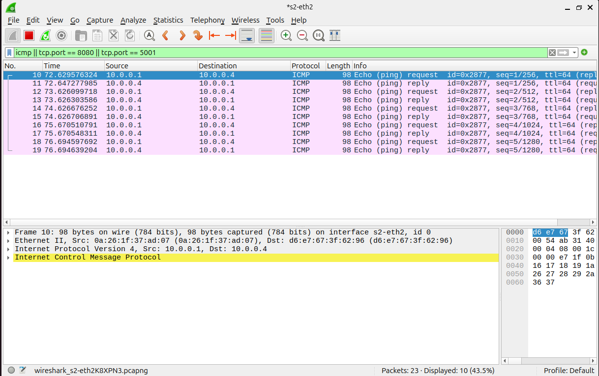

This capture shows ICMP Echo Request and Echo Reply packets between h1 and h4, confirming the high-priority traffic flow.

### 14.2 HTTP Capture

**Image:** screenshots/wireshark/wireshark_http_8080.png

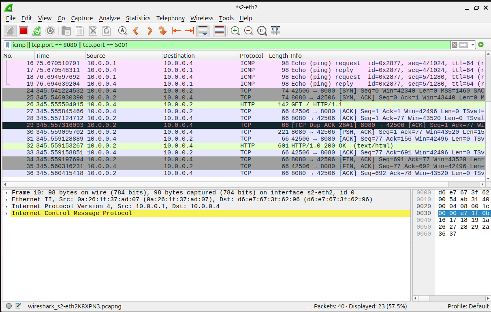

This capture shows TCP handshake packets, an HTTP GET request, and an HTTP 200 OK response, confirming the medium-priority HTTP flow.

### 14.3 Bulk TCP Capture

**Image:** screenshots/wireshark/wireshark_iperf_5001.png

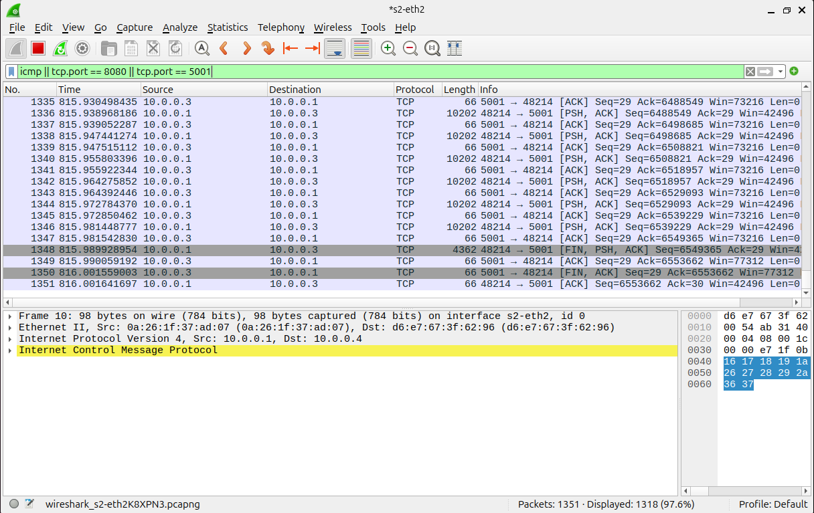

This capture shows repeated TCP packets with data-carrying flags, confirming the low-priority bulk transfer generated using iPerf.

### 14.4 Mixed Traffic Capture

**Image:** screenshots/wireshark/wireshark_all_traffic.png

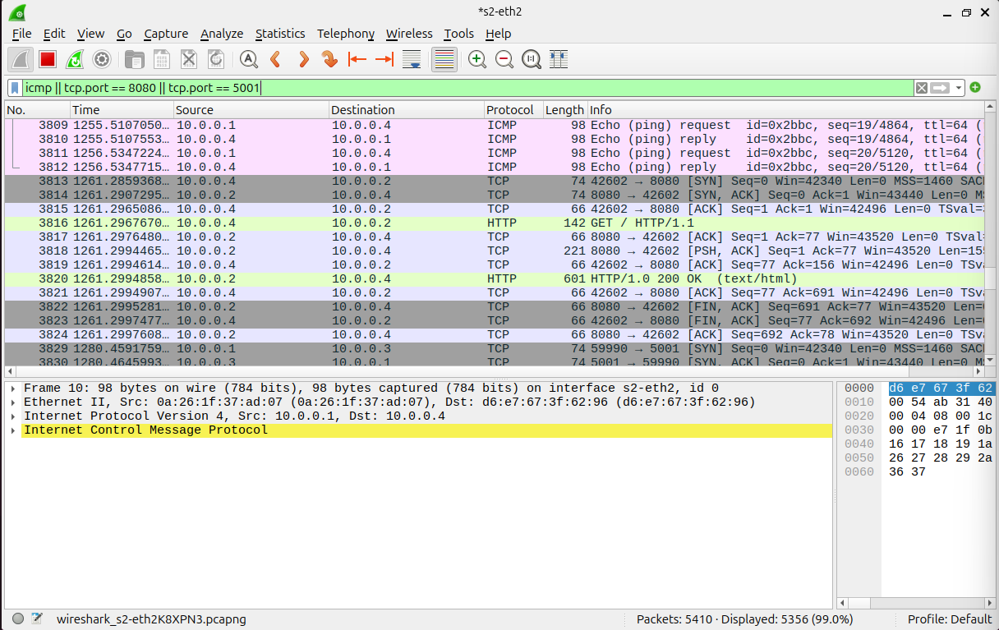

This capture is especially important because it shows ICMP, HTTP, and TCP port 5001 traffic in a single observation window. It proves that all three traffic classes coexist simultaneously in the network and traverse the bottleneck together.

---

## 15. Controller Behavior Analysis

The POX controller logs provide evidence of classification decisions.

**Controller Initialization**

**Image:** screenshots/terminal/09_pox_controller1.png

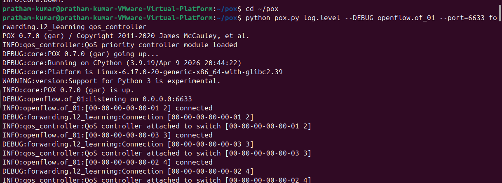

This screenshot shows that the QoS module was loaded successfully and that POX was running and listening for switch connections.

**High-Priority Flow**

**Image:** screenshots/terminal/09_pox_controller2.png

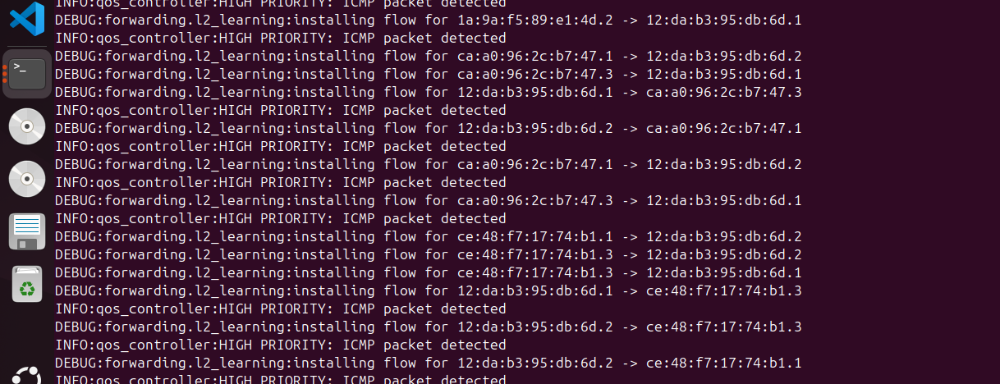

This screenshot shows controller logs for ICMP traffic, classified as high priority.

**Medium-Priority Flow**

**Image:** screenshots/terminal/09_pox_controller3.png

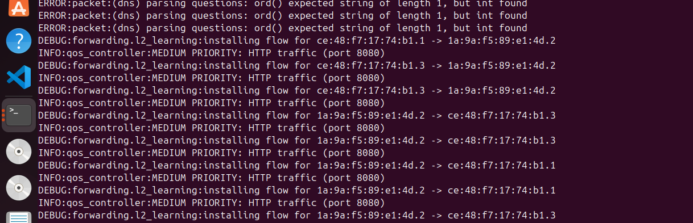

This screenshot shows controller logs for HTTP traffic on port 8080, classified as medium priority.

**Low-Priority Flow**

**Image:** screenshots/terminal/09_pox_controller4.png

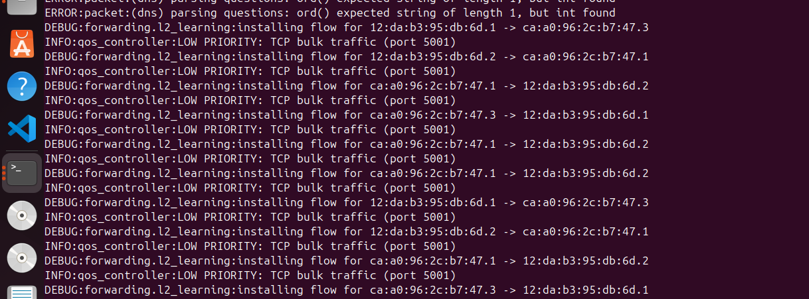

This screenshot shows controller logs for TCP bulk traffic on port 5001, classified as low priority.

Together, these controller logs confirm that the controller is actively inspecting and differentiating traffic classes. The implementation report explicitly uses these screenshots to show controller behavior under different traffic types.

---

## 16. Observations

The following important observations were made during the project:

1. SDN allows centralized observation and control of traffic through the controller.
2. Without the controller, forwarding behavior does not function correctly in this setup.
3. The custom POX controller successfully classifies traffic into high, medium, and low priority categories.
4. ICMP traffic is small and delay-sensitive, making it suitable for high-priority observation.
5. HTTP traffic shows normal request-response behavior and represents moderate application-layer traffic.
6. iPerf traffic produces bulk transfer and occupies more bandwidth.
7. When all three traffic types are generated together, contention occurs at the bottleneck switch.
8. Wireshark confirms simultaneous packet traversal at the bottleneck.
9. The controller logs clearly distinguish traffic based on protocol and port.

---

## 17. Conclusion

This project successfully demonstrates the implementation and analysis of a **QoS Simple Priority Controller** in a Software Defined Networking environment using Mininet and POX.

A custom 3-switch, 4-host bottleneck topology was created, and a POX-based controller was developed to classify traffic into high, medium, and low priority categories. Multiple traffic scenarios were executed, including individual traffic flows, concurrent two-flow scenarios, and a final mixed-traffic scenario. Packet-level evidence was captured using Wireshark, and controller behavior was validated using terminal logs.

The project shows how SDN can be used to analyze traffic centrally and how a simple priority model can be demonstrated effectively in a virtual network. The combination of controller-side logging, Mininet outputs, iPerf throughput, ping behavior, HTTP communication, and Wireshark captures provides a complete and convincing validation of the implemented system.

---

## 18. Future Scope

This project can be extended in several ways:

- implementing true OpenFlow rule prioritization and queue enforcement,
- adding queue-based QoS scheduling,
- measuring jitter and packet loss quantitatively,
- using Ryu or more advanced controllers,
- extending the topology for larger-scale experiments,
- introducing failure scenarios and dynamic rerouting.

These directions are also reflected in the future scope sections of the reports.

---

## 19. Repository Structure
```bash
controller/
  qos_controller.py

topology/
  qos_topology.py

screenshots/
  terminal/
    01_cleanup.png
    02_topology_run.png
    03_pingall.png
    04_http_test.png
    05_iperf_test.png
    06_ping_iperf.png
    07_http_iperf.png
    08_all_traffic.png
    09_pox_controller1.png
    09_pox_controller2.png
    09_pox_controller3.png
    09_pox_controller4.png

  wireshark/
    wireshark_icmp.png
    wireshark_http_8080.png
    wireshark_iperf_5001.png
    wireshark_all_traffic.png

reports/
  SDN_REPORT1.pdf
  SDN_REPORT2.pdf

README.md
.gitignore
```

---

## 20. How to Run the Project Again

**Start the controller**

```bash
cd ~/pox
python pox.py log.level --DEBUG openflow.of_01 --port=6633 forwarding.l2_learning qos_controller
```

**Start the Mininet topology** 

```bash
cd ~/sdn-qos-project
sudo mn -c
sudo mn --custom topology/qos_topology.py --topo qos --controller=remote,ip=127.0.0.1,port=6633 --link tc,bw=10
```

**Basic verification**
```bash
pingall
```

**HTTP test**
```bash
h2 python3 -m http.server 8080 &
h4 curl http://10.0.0.2:8080
```
**iPerf test**

```bash
h3 iperf -s -p 5001 &
h1 iperf -c 10.0.0.3 -p 5001 -t 5
```
**Final mixed scenario**

```bash
h2 python3 -m http.server 8080 &
h3 iperf3 -s -p 5001 &
h1 ping -c 10 h4 &
h4 curl http://10.0.0.2:8080 &
h1 iperf3 -c 10.0.0.3 -p 5001 -t 10
```

---

## 21. Viva Questions and Answers

**1. What is Software Defined Networking?**

Software Defined Networking is a networking approach in which the control plane is separated from the data plane. A centralized controller manages the forwarding behavior of network devices.

**2. Why is SDN useful?**

SDN is useful because it provides centralized control, programmability, easier policy implementation, and better visibility of network behavior.

**3. What is the role of Mininet in this project?**

Mininet is used to emulate the network. It provides virtual hosts, switches, and links so that the SDN system can be tested without physical networking hardware.

**4. What is the role of POX in this project?**

POX acts as the SDN controller. It receives events from switches, inspects traffic, and applies controller logic such as traffic classification.

**5. What is the meaning of PacketIn?**

PacketIn is an OpenFlow message sent from a switch to the controller when the switch does not know how to handle a packet according to its current rules.

**6. Why was switch s2 chosen as the bottleneck?**

s2 is in the middle of the topology, so traffic moving between the left side and the right side must pass through it. This makes it the natural point to observe congestion and competing flows.

**7. Why was ICMP treated as high priority?**

ICMP was used to represent latency-sensitive traffic. Ping is useful for latency observation and should ideally remain responsive even under competing traffic.

**8. Why was HTTP treated as medium priority?**

HTTP represents application-layer request-response traffic. It is important to keep it responsive, but it is typically less delay-sensitive than control-style traffic such as ICMP.

**9. Why was iPerf traffic treated as low priority?**

iPerf generates bulk TCP transfer traffic. It is useful for throughput measurement, but it can tolerate more delay and therefore was treated as low-priority traffic in this simple QoS model.

**10. How did you validate your project?**

The project was validated through Mininet terminal outputs, ping results, HTTP request-response verification, iPerf throughput measurements, controller logs, and Wireshark captures.
